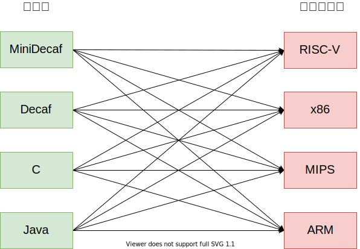

# 使用中间码

## 实验指导 step1：使用中间码

我们继续改进上一步我们得到的编译器，这次要做的是： **使用中间码让编译器更模块化**。

### 栈机器和中间表示

```text
        词法分析           语法分析           IR生成         目标代码生成
字节流 ----------> Tokens ----------> 语法树 --------> *IR* --------------> RISC-V 汇编
```

**中间表示**（也称中间代码，intermediate representation / IR）是位于语法树和汇编之间的一种程序表示。 它不像语法树一样保留了那么多源程序的结构，也不至于像汇编一样底层。 我们的实验中，使用简单的栈式机 IR，[这里](qi-ta/ir.md)是它的一个详细描述。

容易看出，IR 的好处有如下几点

* 缩小调试范围，通过把 AST 到汇编的步骤一分为二。

  > 通过观察 IR 是否正确生成就能知道：到底是 IR 生成这一小步有问题，还是 IR 到汇编这一小步有问题。 比起 AST 到汇编当成一整个大步骤，分成两个小步，每步代码更少，更容易调试。

* 实际中，有了 IR 更容易适配不同指令集（RISC-V, x86, MIPS, ARM...）和源语言（MiniDecaf, Decaf, C, Java...）。

  > 不同源语言的 AST 不同，直接从 AST 生成汇编的话，为了支持 N 个源语言和 M 个目标指令集，需要写 N \* M 个目标代码生成模块：
  >
  > 
  >
  > 如果有了 IR，只需要写 N 个 IR 生成和 M 个汇编生成，一共 N + M 个模块：
  >
  > 

我们使用的 IR 是栈式机 IR，它生成很简单、翻译到汇编也很简单。

> 一些助教的实现中显式地有 IR，以及对应的 IR 生成和从 IR 到目标代码这两个阶段；而另一些助教的实现则没有，他们是直接从 AST 生成汇编。 你的实现可以选择这两种方法中的任何一个，不一定非要显式地生成 IR。
>
> 指导书中的 IR 主要目的是更清晰地说明，栈机器上有哪些操作。 就算你直接从 AST 生成汇编，你生成的汇编也是栈机器上的操作，这些操作也需要被准确描述。 而 IR 就完成描述栈式机操作的任务。

### 从 AST 到 IR

```text
        词法分析           语法分析           *IR生成*      目标代码生成
字节流 ----------> Tokens ----------> 语法树 ---------> IR ---------------> RISC-V 汇编
```

显然，这一步的 _输入_ 是 AST， _输出_ 是一个 IR  序列。

> 例如前面的 `int main(){return 0;}` 例子，输出如 \[push 0, ret\]

每步我们只介绍这一步必须用到的 IR 指令，而不是一开始就介绍所有指令。 对于 step1，我们只需要两个 IR 指令：`push`、`ret`，如下表。

| 指令 | 参数 | 含义 | IR 栈大小变化 |
| :--- | :--- | :--- | :--- |
| `push` | 一个整数常数 | 把一个常数压入栈中 | 增加 1 |
| `ret` | 无参数 | 弹出栈顶元素，将其作为返回值返回当前函数 | 减少 1 |

并且我们有如下的假设：

* 考虑源代码中某个表达式被翻译成了一系列 IR 指令，那么执行这些 IR 指令后，IR 栈大小必须恰好增加 1，栈顶就是表达式的值。

  > 显然，整数常量作为表达式，它被翻译为 `push` 指令，满足假设。

* 执行任何语句对应的 IR 指令序列，执行完成后 IR 栈大小不变。

  > 就 step1 而言，return 语句也满足这条假设。

* 执行任何 `n` 元操作之前，栈顶的 `n` 个元素就是操作数。

  `n` 元操作将这 `n` 个元素弹出，进行操作，再把结果压回栈中。

由此，step1 中 AST 翻译到 IR 就很简单了，只需要按照如下规则访问 AST 中的节点： 1. 遇到 `Integer(X)`：生成一条 `push X`。 2. 遇到 `Return expr ;`：先生成 `expr` 对应的 IR，然后生成一条 `ret`。

### IR 翻译到汇编

```text
        词法分析           语法分析           IR生成        *目标代码生成*
字节流 ----------> Tokens ----------> 语法树 ---------> IR ---------------> RISC-V 汇编
```

栈机器 IR 翻译到汇编非常简单，如下表，多条汇编指令用分号隔开：

| IR | 汇编 |
| :--- | :--- |
| `push X` | `addi sp, sp, -4  ;  li t1, X  ;  sw t1, 0(sp)` |
| `ret` | `lw a0, 0(sp)  ;  addi sp, sp, 4  ;  jr ra` |

> 简要解释：li t1 X 表示加载立即数 X 到寄存器 t1；RISC-V 和 x86 一样栈顶比栈底的地址低，所以压栈 4 字节是栈指针 sp 减 4。 （RISC-V 的栈顶指针是 sp，类似 MIPS 的 $sp 和 x86 的 %esp 或 %rsp。）
>
> a0 存放返回值，ra 存了调用者地址，jr ra 就是子函数返回。
>
> t1 没有什么特殊的含义，只是用来临时存放数据，你可以换成 t0 / t2 / s1 等。 但不要用 s0，因为它保存了栈帧基地址（同 `%ebp` 和 `$fp`），后面要用到。

IR 栈的每个元素都是 32 位整数，所以 push 使得 IR 栈大小加 1 在我们这里就体现为 `sp` 减 4。

完成后，你对于 `int main(){return 0;}` 应该生成如下汇编

```text
    .text
    .globl main
main:
    addi sp, sp, -4
    li t1, 233
    sw t1, 0(sp)
    lw a0, 0(sp)
    addi sp, sp, 4
    jr ra
```

## 任务

1. （可选，推荐）改进你上一步的代码，先生成 IR，再从 IR 生成汇编。
2. （和 1. 二选一）改进你上一步的代码，用栈机器的思路直接从 AST 生成汇编。

## 总结

我们引入 IR 来说明栈机器上能执行那些操作，并用 IR 把目标代码生成阶段一分为二。

## 备注

