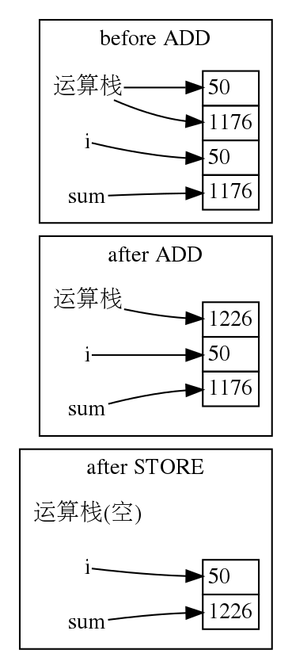

# 中间代码

中间代码(也称中间表示，[Intermediate Representation](https://en.wikipedia.org/wiki/Intermediate_representation), IR)是表示程序结构的一种方式，在后续的实验指导中，我们会先介绍怎么由AST生成IR，再介绍怎么由IR生成汇编代码。尽管直接由AST生成汇编代码在我们的实验中也是完全可行的，我们也不强求你使用IR，但是保留这个中间步骤更加符合真实的编译器的工作流程，也能让你的程序结构更加清晰。

一般真实的编译器都有IR这个中间步骤，这是因为IR一般比AST更加接近汇编，同时仍然保存了一些程序中的高级信息，更加适合进行各种优化。IR有很多种类，包括三地址码([Three Address Code](https://en.wikipedia.org/wiki/Three-address_code), TAC)，静态单赋值形式([Static Single Assignment Form](https://en.wikipedia.org/wiki/Static_single_assignment_form), SSA)，基于栈的IR，等等。如果你感兴趣的话可以自行查阅了解，这里不做要求。

我们的实验指导选择使用基于栈的IR。这种IR的最大特点是中间代码生成和汇编代码生成(不追求性能的话)非常容易编写，但是一般实际的编译器都不会使用它，因为它并不适合进行优化[^1]，这样其实也就失去了IR存在的根本意义之一了。尽管如此，我们的指导还是选择使用基于栈的IR，主要目的是希望体现IR这个结构在实际的编译器中的地位，**尽量**让大家体会感受编译器的工作流程，只是限于课程的工作量的限制还是没法和实际的编译器做到真正的一致。

基于栈的IR顾名思义需要维护一个运算栈，它最主要的特点在于它的运算指令，例如加法和减法指令这些，是没有显式的操作数的。例如在编程语言中常常会写`a = b + c`，这里的`b`和`c`就是加法操作的操作数，而基于栈的IR中则不存在这样的结构，相当于只用一个加号来表示加法，不给出这个加法的操作数。这样的的运算指令的语义都是从这个运算栈的顶部弹出操作数，进行运算后再把结果压回栈中。

# 例子：一加到一百

在之后的每个step中，我们都会介绍(我们推荐的)加入IR的新指令。尽管如此，这里为了给大家留下一些直观的印象，还是先定义一套简单的基于栈的IR，并且用它表示一个简单的例子：计算一加到一百的和。

定义如下指令：

- `PUSH x`: 往运算栈中压入常数`x`
- `LOAD var`: 将变量`var`的值读出，压入栈中
- `STORE var`: 从栈顶弹出一个值，写入变量`var`
- `LABEL l`: 定义一个名为`l`的标号
- `BZ l`: 从栈顶弹出一个值，如果该值等于0，则跳转到标号`l`执行，否则继续执行下一条指令
- `B l`: 无条件跳转到标号`l`执行
- `CMP_LE`/`ADD`: 两条二元运算指令，从栈上依次弹出两个值，分别作为右操作数和左操作数，执行整数二元运算`<=`/`+`，将结果压入栈中

有几点可能是比较容易引起疑惑的，这里简单解释一下：

- 很多指令(其实是除了`CMP_LE`/`ADD`之外的所有指令)都有额外的参数，看起来不符合上面说的"运算指令没有显式的操作数"的特点。可以理解成额外参数和操作数是不一样的，前者是静态确定的，例如`LOAD var`每次执行，读取的都是同一个变量的值；后者是动态确定的，例如`ADD`每次执行，弹出的栈上的两个值都可能是不一样的
- 上面提到了"变量"的概念，变量是保存在哪里的呢？假如要把这个IR最终翻译成汇编，运算栈显然会用栈来实现，而局部变量其实也只能保存在栈上，虽然保存在很接近的物理区域，但是它们逻辑上并不是运算栈的一部分，对局部变量的写入不应该影响到运算栈，在运算栈上进行的弹栈/压栈操作也不应该影响到局部变量。
- 上面提到的`var`，`l`这样的名字，实际实现的时候可以选择用整数来表示，而下面的程序中为了清晰起见，还是用人可读的名字来表示。

下面我们用这个IR来表示如下的C程序：

```c
int sum = 0;
int i = 1;
while (i < 100) {
  sum = sum + i;
  i = i + 1;
}
```

转化的结果如下(`#`后的是注释)：

```python
PUSH 0
STORE sum # int sum = 0;
PUSH 1
STORE i # int i = 0;
LABEL loop
LOAD i
PUSH 100
CMP_LE # 计算i <= 100，前两句依次把左操作数i和右操作数100压入栈中
BZ end # 现在栈顶是i <= 100的结果，弹出它，如果它为0，即i <= 100不成立，则循环结束，否则进入循环体(下一条指令)
LOAD sum
LOAD i
ADD # * 计算sum + i，前两句依次把左操作数sum和右操作数i压入栈中
STORE sum # ** 现在栈顶是sum + i的结果，弹出它，并且保存到sum中
LOAD i
PUSH 1
ADD # # 计算i + 1，前两句依次把左操作数i和右操作数1压入栈中
STORE i # 现在栈顶是i + 1的结果，弹出它，并且保存到i中
B loop # 回到loop的位置，又一次判断循环条件，执行循环体
LABEL end
```

我们有一个 ir.py（[代码](https://github.com/decaf-lang/minidecaf-tutorial-code/blob/master/step0/ir.py)）能运行上面程序，结果的确是 1+2+...+100=5050.

```bash
$ python3 ir.py
5050
```

标有`*`和`**`的两条指令在`i = 50`时执行前后的状态变化如下：



这里局部变量`sum`和`i`的保存位置就和上面描述的差不多，与运算栈保存在接近的物理区域，但是二者互不干扰。

执行`ADD`前，运算栈上恰好有两个元素，也就是前两条指令依次压入栈中的`sum`和`i`的值，当前栈顶的值是`i`的值50。执行`ADD`时，将这两个值依次弹出，栈顶的值作为右操作数，栈顶下的一个值作为左操作数，执行加法得到1226，再把1226压回栈中，执行完后运算栈上恰好有一个元素1226。

执行`STORE sum`时，将栈顶的1226弹出，存入`sum`所在的位置，执行完后`sum`的值被更新为1226，运算栈为空。

# 备注

[^1]: 类似[Java Bytecode](https://en.wikipedia.org/wiki/Java_bytecode)这样的，虽然也属于基于栈的IR，但是实际的Java虚拟机中都会先把它转化成其它容易优化的形式，所以它的意义仅仅是便于生成和传输，几乎不会用于优化。这也启示我们，尽管我们选择了不容易优化的基于栈的IR，但未来还是有拓展的空间，可以把它转化成其他形式再进行优化。
