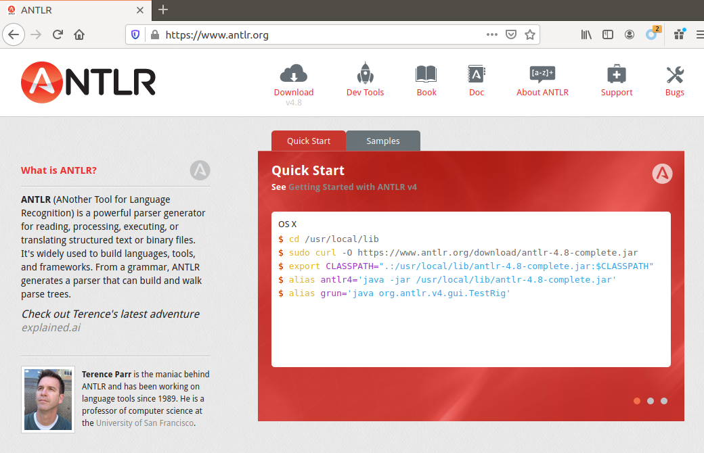

# 实验指导 step1：词法语法分析工具
第一部分中，我们已经自己从零开始暴力实现了一个编译器，但是暴力的 minilexer/miniparser 有几个问题：
1. 运行效率较低，minilexer 比正经 lexer 时间复杂度更高（lexer的耗时可以做到只与输入串长度成正比，而与token种类数无关）；
2. 算法太弱，尤其是 miniparser，处理不了越来越复杂的 MiniDecaf。

接下来我们选择更成熟通用的方法，这里你有两种选择
1. 使用工具辅助完成词法语法分析，而不是完全自己编写：请看下面的【工具概述】；
    > * 优点：代码量很少，方便。
    > * 缺点：要学工具，不能更深入理解 lexer/parser 底层。
2. 完全自己编写 lexer/parser，请看下面的【手写 lexer 和 parser】。
    > * 优点：完整理解 lexer/parser。
    > * 缺点：要学算法，代码量更大，而且也不可能理解所有常见的parser算法，只能理解你选择的哪一个。

## 工具概述
从 minilexer/miniparser 的代码可以看出，lexer 和 parser 包含两部分：
1. 被分析的词法/语法的**描述**。例如 minilexer 的 `TokenKind` 列表，以及 miniparser 的 `rules` 字符串；
2. lexer 和 parser 的**驱动代码**。例如 `lex` 和 `parse` 函数。

使用工具，我们只需要完成第 1. 步，描述被分析的词法或者语法。
然后工具从我们的描述，自动生成 lexer 或者 parser 供你使用，十分方便。

> 所以这类工具被称为 lexer/parser generator，例子有：C 的 lex/yacc、往届使用的 Java 的 JFlex / Jacc、MashPlant 助教的 re2dfa/lalr1。
>
> 对有兴趣的同学：除了这类工具以外，还有一类工具称为 parser combinator，多在函数式语言中使用。
> 最有名的如 Haskell 的 parsec、scala 的 fastparse，rust 的 nom。课程不涉及其中内容。

下面是助教写的一些工具的速成介绍，你可根据你选择的语言和实现方式，从中选择一个学习使用，
你也可以自己另找其他工具自学使用。

### ANTLR
[ANTLR](https://www.antlr.org/) 支持生成很多语言的代码，它的特点是方便易用人性化，请先仿照官网的 “Quick Start” 安装。
和前面[环境配置](../lab0/env.md)一样，强烈推荐你把 `export CLASSPATH...` 和 `alias...` 那几条命令放进 `~/.bashrc` 里。
> 
> 上面官网截图是 MacOS 的用法，Linux 的用法如下：
> 
> 上面的 `wget` 如果有 permission error，请运行 `sudo wget ...`。`curl` 也一样。

速成文档在[这里](./antlr.md)。

特别注意：如果输入有错误，ANTLR 的 parser 默认会尝试从错误恢复。
但我们实验要求是：如果输入有错，那编译器应该立马报错退出。
因此我们要设置 ANTLR parser 的错误处理为 `BailErrorStrategy`，具体可见附带代码中的设置方式（[python版](https://github.com/decaf-lang/minidecaf-tutorial-code/blob/master/step1/maineval.py#L55)、[java版](https://github.com/decaf-lang/minidecaf-tutorial-code/blob/master/step1/MainEval.java#L13)）。

### lalr1
[lalr1](https://github.com/MashPlant/lalr1)是 MashPlant 助教自己编写的 parser generator，它用 Rust 编写，可以生成多种目标语言（目前实现了 Rust, C++, Java）。虽然还不能和那些常用的成熟工具链相比，但也已经在 2019 年的编译原理课程中经受住了考验，可靠性是有一定保证的。

lalr1的使用指导在[这里](https://mashplant.online/2020/08/17/lalr1-introduction/)。

## 手写 lexer 和 parser
手写 lexer: 一种可行的做法是沿用minilexer的做法（虽然它效率低，但是我们对效率也没有要求），依次用所有token种类的正则表达式尝试匹配剩余字符串的开头，选择其中最长的匹配，如果有多个长度相等的匹配，则选择最先出现的。

另一种做法是手动模拟DFA执行的过程，根据当前状态和读入的字符转移到下一个状态。例如在初始状态0看到字符`'i'`，转移到状态1；接着看到`'n'`，转移到状态2；接着看到`'t'`，转移到状态3。一部分状态下lexer已经识别出一个token，比如这里的状态3，这时如果看到`' '`，无法继续转移，那么就成功识别了`int`这个token。

手写 parser: 参见[这里](./manual-parser.md)。

# 任务
二选一

1. **如果你选择使用工具**：按照你选择的工具，描述 step1 的 MiniDecaf 词法语法（可参考本章规范），并从 AST 生成汇编。
2. **如果你选择不使用工具**：实现你自己的 lexer 和 parser，并生成汇编。
