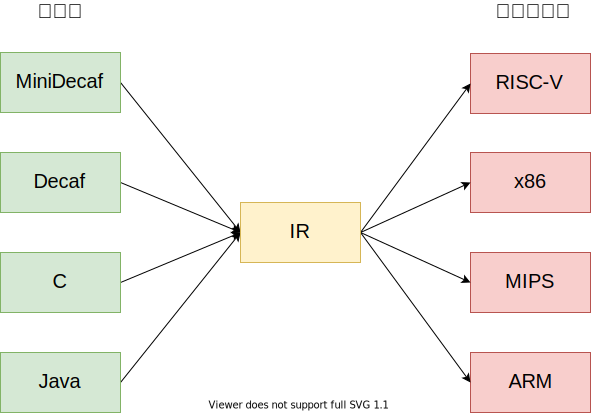

# 实验指导 step1：使用中间码
我们继续改进上一步我们得到的编译器，这次要做的是： **使用中间码让编译器更模块化**。


## 栈机器和中间表示
```
        词法分析           语法分析           *IR生成*      *目标代码生成*
字节流 ----------> Tokens ----------> 语法树 ---------> IR ---------------> RISC-V 汇编
```

参见 lab0/ir（等待完善）。

容易看出，IR 的好处有如下几点
* 缩小调试范围，通过把 AST 到汇编的步骤一分为二。
> 通过观察 IR 是否正确生成就能知道：到底是 IR 生成这一小步有问题，还是 IR 到汇编这一小步有问题。
> 比起 AST 到汇编当成一整个大步骤，分成两个小步，每步代码更少，更容易调试。
* 更容易适配不同指令集（RISC-V, x86, MIPS, ARM...）和源语言（MiniDecaf, Decaf, C, Java...）。
> 不同源语言的 AST 不同，直接从 AST 生成汇编的话，为了支持 N 个源语言和 M 个目标指令集，需要写 N * M 个目标代码生成模块：
>
> 
>
> 如果有了 IR，只需要写 N 个 IR 生成和 M 个汇编生成，一共 N + M 个模块：
>
> 
* 更容易添加不同源语言。
> 假设同样的 IR

我们使用的 IR 是栈式机 IR，它生成很简单、翻译到汇编也很简单。
> 当然，就课程实验来说，你不一定非要显式地生成 IR，可以直接从 AST 生成汇编。
> 但只要按照实验指导书的思路，你一定会使用栈机器的思路思考，
> 哪怕直接从 AST 生成汇编，也本质上是在用汇编实现 IR。
> 所以指导书中，会把 IR 单独拿出来，不会直接讨论 AST 如何翻译到汇编。

## 从 AST 到 IR
```
        词法分析           语法分析           *IR生成*      目标代码生成
字节流 ----------> Tokens ----------> 语法树 ---------> IR ---------------> RISC-V 汇编
```

显然，这一步的 *输入* 是 AST， *输出* 是一系列 IR [^1]
> 例如前面的 `int main(){return 0;}` 例子，输出如 [const 0, ret]

每步我们只介绍必须的 IR，而不是一股脑全整完。
对于第一步，我们只需要两个 IR 指令：`const`、`ret`，如下表。

| 指令 | 参数 | 含义 | IR 栈大小变化[^2] |
| --- | --- | --- | --- |
| `const` | 一个整数常数 | 把一个常数压入栈中 | 增加 1 |
| `ret` | 返回栈顶元素 | 弹出栈顶元素，将其作为返回值返回当前函数 | 减少 1 |

并且我们有如下的假设：
* 考虑源代码中某个表达式被翻译成了一系列 IR 指令，那么从任何初始状态出发执行这些 IR 指令，
  完成后 IR 栈大小增加 1，栈顶就是表达式的值。
* 执行任何语句对应的 IR 指令序列，执行完成后 IR 栈大小不便。
* 执行任何 `n` 元操作之前，栈顶的 `n` 个元素就是操作数。

由此，step1 中 AST 翻译到 IR 就很简单了。只需要 Visitor 遍历 AST，然后
1. 遇到 `Integer(X)`：生成一条 `const X`，栈大小加 1。
2. 遇到 `Return expr ;`：先生成 `expr` 对应的 IR，栈大小加 1；然后生成一条 `ret`，栈大小和原来相同。

## IR 翻译到汇编
```
        词法分析           语法分析           IR生成        *目标代码生成*
字节流 ----------> Tokens ----------> 语法树 ---------> IR ---------------> RISC-V 汇编
```

栈机器 IR 翻译到汇编非常简单，如下表，多条汇编指令用分号隔开：

| IR       | 汇编                                                |
| ---      | ---                                                 |
| `push X` | `addi sp, sp, -4  ;  li t1, t1, X  ;  sw t1, 0(sp)` |
| `ret`    | `lw a0, 0(sp)  ;  addi sp, sp, 4  ;  jr ra`                   |

> 简要解释：li t1 X 表示加载立即数 X 到寄存器 t1；RISC-V 和 x86 一样栈顶比栈底的地址低，所以压栈 4 字节是栈指针 sp 减 4。
> （RISC-V 的栈顶指针是 sp，类似 MIPS 的 $sp 和 x86 的 %esp 或 %rsp。）
>
> a0 存放返回值，ra 存了调用者地址，jr ra 就是子函数返回。
>
> t1 没有什么特殊的含义，你可以换成 t0 / t2 / s1 等。
> 但不要用 s0，因为它保存了栈帧基地址（同 `%ebp` 和 `$fp`），后面要用到。

IR 栈的每个元素都是 32 位整数，所以 push 使得 IR 栈大小加 1 在我们这里就体现为 `sp` 减 4。

完成后，你对于 `int main(){return 0;}` 应该生成如下汇编
```
	.text
	.globl main
main:
	addi sp, sp, -4
	li t1, 233
	sw t1, 0(sp)
	lw a0, 0(sp)
	addi sp, sp, 4
	jr ra
```

# 任务
1. （可选，推荐）改进你上一步的代码，先生成 IR，再从 IR 生成汇编。
2. （和 1. 二选一）改进你上一步的代码，用栈机器的思路生成汇编。

# 思考题
ANTLR

栈机器

# 总结

# 备注
[^1]: 实际上 `const` 和 `ret` 是 IR 的 *指令*。我们为了简便，通常直接用 IR 代指 IR 指令。
[^2]: 注意区分 IR 栈和汇编中的栈。IR 的栈中包含的元素是整数，IR 栈的大小指栈中有多少个整数。对于 IR 的栈不存在“字节”这一概念。
