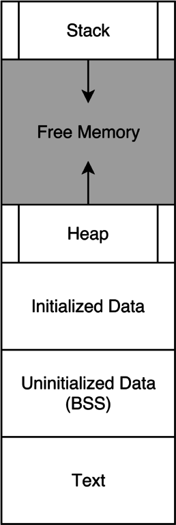

## 代码生成

全局变量需要住在内存中的某个地方。它们不能住在栈上，因为它们需要能够被每个函数访问，而每个函数的栈都是独立的。取而代之的是，它们生活在另一块内存中，即数据段（data section）。我们已经看到了一个正在运行的程序的栈是什么样的，现在让我们退一步，看看它的所有内存是如何布局的。



我们之前一直在处理的 RISC-V 指令都在代码段（text section），而全局变量则在数据段（data section）。我们可将其进一步细分为初始化和未初始化的数据，以及只读数据段等，其中未初始化的数据段通常称为 BSS，会在程序加载时被初始化为 0；只读数据段（rodata）用于保存程序中定义的常量，在本实验中不会用到。

在编写自己的代码生成器之前，我们先来看看 GCC 是如何生成全局变量的代码的。

```c
int N = 2333;
int main() {
    return N;
}
```

使用以下命令编译出汇编代码：

```bash
$ riscv64-unknown-elf-gcc test.c -S -o test.S
$ cat test.S
    .file   "test.c"
    .option nopic
    .text
    .section    .text.startup,"ax",@progbits
    .align  1
    .globl  main
    .type   main, @function
main:
    lui a5,%hi(N)
    lw  a0,%lo(N)(a5)
    ret
    .size   main, .-main
    .globl  N
    .section    .sdata,"aw"
    .align  2
    .type   N, @object
    .size   N, 4
N:
    .word   2333
    .ident  "GCC: (SiFive GCC 8.2.0-2019.05.3) 8.2.0"
```

### 全局变量定义

从上述结果中，很容易找到全局变量 `N` 的定义部分，去掉一些无关内容并简化后如下：

```asm
    .globl  N       # 让符号 N 对链接器可见
    .data           # 即 .section .sdata,"aw"，表示接下来是数据段，内容可写
    .align  2       # 接下来的数据需要 4 字节对齐
N:
    .word   2333    # 在数据段分配一个字（4 字节）大小的整数，值为 2333
```

这里有几件事要注意：

* `.data` 指示符告诉汇编器我们在数据段。我们还需要一个 `.text` 指示符来告诉我们何时切换回代码段。
* 像 `N` 这样的标签可以标注一个内存地址。汇编器和链接器并不关心这个地址是指代码段的指令还是数据段的变量，它们会以同样的方式处理它。
* `.align n` 的意思是“下一个东西的起始地址应为 $$2^n$$ 字节的倍数”。

> 有关 RISC-V 汇编指示符（directives）的更多内容 ，详见 https://github.com/decaf-lang/minidecaf/blob/master/doc/riscv-assembly-directives.md

在具体实现时，我们每遇到一个全局变量，就生成类似以上的代码。对于未初始化的全局变量，简单起见我们无需考虑 BSS 段，直接将其初始化为 0 即可。

### 全局变量引用

从 GCC 的结果中我们也可以得到引用一个全局变量的方法：

```asm
lui a5,%hi(N)       # 将 N 地址的高 20 位作为立即数加载到 a5，低 12 位设为 0
lw  a0,%lo(N)(a5)   # 从内存中读出数据保存到 a0，内存地址为 a5 加上 N 地址的低 12 位
```

注意到这里用了两条指令，而不是类似 `lw a0, 0(N)` 的一条，这是因为 `N` 在这里是个标签，其实际值是一个 32 位的地址，这超过了一条长度为 4 字节的指令的表示能力。

对于给全局变量赋值的情况也类似，只不过是把 `lw` 换成了 `sw`。
