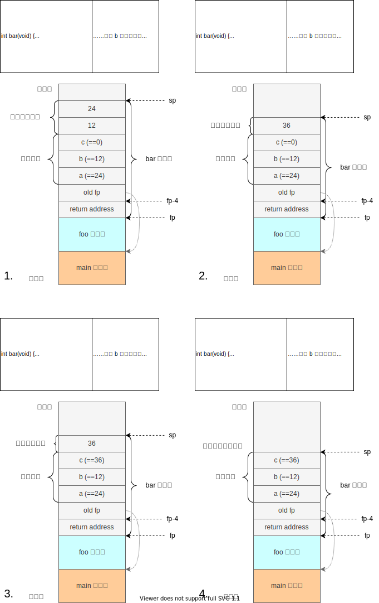

# 栈帧
我们曾经在[step1](../lab1/ir.md)提到，“局部变量其实也只能保存在栈上”。
所以我们需要确定栈（包括 IR 的栈和汇编的栈）上面到底有那些元素，这些元素在栈上的布局如何。

汇编语言课上提到过 **栈帧（stack frame）** 的概念，简单回想一下：
每次调用和执行一个函数，都会在栈空间上开辟一片空间，这篇空间就叫“栈帧”。
栈帧里存放了执行这个函数需要的各种数据，包括局部变量、callee-save 寄存器等等。
当然，既然汇编有栈帧, 栈式机 IR 也有栈帧。

> 我们只有一个函数 main，直到 step9 我们才会有多函数支持。
> 所以现在关于栈帧的讨论，我们就只考虑一个栈帧。
> 后面的 step 会深入讨论。

关于栈帧，有两个问题需要说明
1. 栈帧长什么样？即、栈帧上各个元素的布局如何？
2. 栈帧是如何建立与销毁的？

第 1. 点，我们规定，程序执行的任何时刻，栈帧分为三块：
1. 栈顶是计算表达式用的运算栈，它可能为空（当前不在计算某表达式的过程中）
2. 然后一片空间存放的是当前可用的所有局部变量
3. 返回地址、老的栈帧基址等信息

下图展现了汇编栈的栈帧结构，以及执行过程中栈中内容的变化。
栈左上方是源代码，右上方是 IR。
粉色背景表示已经执行完的汇编对应的源代码/IR。
假设用户给的输入是 `24 12`。



从中可以看出，栈帧满足如下性质
1. 每条语句开始执行和执行完成时，汇编栈帧大小都等于 `8 + 4 * 局部变量个数` 个字节，其中 `4 == sizeof(int)` 是一个 int 变量占的字节数
2. （就是 step1 中的假设）任何表达式对应的 IR 序列执行结果一定是：栈帧大小增加 4，栈顶四字节存放了表达式的值。
3. 汇编栈帧底部还保存了 `fp` 和返回地址，使得函数执行完成后能够返回 caller 继续执行。

把栈帧设计成这样，访问变量就可以直接用 `fp` 加上偏移量来完成。
例如第 1. 小图中，“读取 a” 就是加载 `-12(fp)`；第 3. 小图中，“保存到 c” 就是保存到 `-20(fp)`。

> 我们只叙述了汇编的栈帧，但 IR 的和汇编的一样（就我们的设计而言），也是三个部分，也要有 old fp 和返回地址。

## 建立栈帧
进入一个函数后，在开始执行函数体语句的汇编之前，要做的第一件事是：建立栈帧。
每个函数最开始、由编译器生成的用于建立栈帧的那段汇编被称为函数的 **prologue**。
就 step5 而言，prologue 要做的事情很简单
1. 分配栈帧空间
2. 保存 `fp` 和返回地址（在寄存器 `ra` 里）

举个例子，下面是一种可能的 prologue 写法。
其中 `FRAMESIZE` 是一个编译期已知的常量，等于 `8 + 4 * 局部变量个数`（这名字不太准确，因为有运算栈，栈帧大小其实不是常量）
```
    addi sp, sp, -FRAMESIZE         # 分配空间
    sw ra, FRAMESIZE-4(sp)          # 储存返回地址
    sw fp, FRAMESIZE-8(sp)          # 储存 fp
    addi fp, sp, FRAMESIZE          # 更新 fp
```

当然，开始执行函数时需要建立栈帧，结束执行时就需要销毁栈帧。
函数末尾、用于销毁栈帧的一段汇编叫函数的 **epilogue**，它要做的是：
1. 回收栈帧空间
2. 恢复 `fp`，跳回返回地址（`ret` 就是 `jr ra`）

下面是 epilogue 一种可能的写法。
> 前缀 `FUNCNAME` 是当前函数函数名，例如 `main`，加上前缀以区分不同函数的 epilogue。
```
FUNCNAME_epilogue:                  # epilogue 标记，可作为跳转目的地
    lw fp, FRAMESIZE-8(sp)          # 恢复 fp
    lw ra, FRAMESIZE-4(sp)          # 恢复 ra
    addi sp, sp, FRAMESIZE          # 回收空间
    jr ra                           # 跳回 caller
```

> 就 step5，保存恢复 fp/ra 的确不必要。但是加上会让后面步骤更方便。

需要注意的是，IR 的 `ret` 指令不能直接 `jr ra` 了，而是要跳转执行 epilogue，即 `j FUNCNAME_epilogue`。

# 变量声明
对于每个变量声明，我们需要
1. 设定变量相对 `fp` 的偏移量。
2. 在栈帧上预留保存变量空间

第 2. 点已经在 prologue 中完成了，所以重点是第 1. 点。

对每个变量用一个数据结构维护其信息，如：名称、类型（step11）、声明位置、初始值等。
目前阶段，你可以简单的使用一个简单的链表或者数组来保存所有变量的信息。
这个保存变量符号的表被称为 **符号表**。
那偏移量可以（一）作为变量数据结构的一个字段、（二）也可以维护一个变量到偏移量的映射、（三）像下面通过某种方法计算得到。

确定变量的偏移量本身倒很容易：从前往后每一个声明的变量偏移依次递减，从 `-12(fp)` 开始，然后是 `-16(fp)`、`-20(fp)` 以此类推。
所以对于每个变量，我们只需在其数据结构中记录：它是从前往后第几个变量。
第 `k>=0` 个变量的偏移量就是 `-12-4*k`。

> 目前我们没有作用域，这样做是没问题的，但在第7章引入作用域后，这种暴力的实现会出现一些问题。

