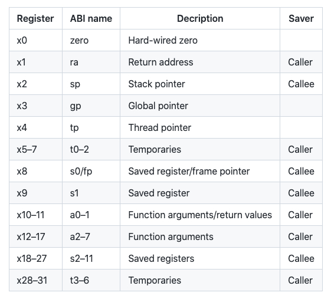

# MiniDecaf 编译器结构
MiniDecaf 编译器大致划分为三个部分：前端、中端、后端。通过编译器前端，可以读入 MiniDecaf 源程序，然后通过**词法分析**和**语法分析**将源程序转化为一个**抽象语法树**（Abstract Syntax Tree, AST)，接下来通过扫描 AST 进行语义分析，检查是否存在语义错误；在编译器中端，通过扫描 AST 生成中间代码 —— 三地址码；在编译器后端中，将三地址码转换为 **RISC-V 汇编代码**。下面依次介绍上述编译步骤，以及对应框架代码的位置。

> 我们在这里针对每个步骤只是简要介绍，目的是给同学们一个大致的印象：编译器到底是由哪些部分组成的，这些部分又有什么作用。具体的技术点，我们将在用到的 step 作详细介绍。

## 词法分析和语法分析

> 此部分对应框架源码位置：
>
> C++ 框架：词法分析程序位于 `src/frontend/scanner.l`；语法分析程序位于 `src/frontend/parser.y`；语法树位于 `src/ast/`。
>
> Python 框架：词法分析程序位于 `frontend/lexer`；语法分析程序位于 `frontend/parser`；语法树位于 `frontend/ast`。

编译器前端分为两个子任务，一是**词法分析**，二是**语法分析**。词法分析的功能是从左到右扫描 MiniDecaf 源程序，识别出程序源代码中的标识符、保留字、整数常量、算符、分界符等单词符号（即终结符），并把识别结果返回给语法分析器，以供语法分析器使用。语法分析是在词法分析的基础上针对所输入的终结符串建立语法树，并对不符合语法规则的 MiniDecaf 程序进行报错处理。一般而言，这一步所生成的语法树并非表示了所有语法细节的语法分析树，而是只表示其树形结构的抽象语法树（[Abstract Syntax Tree, AST](https://en.wikipedia.org/wiki/Abstract_syntax_tree)）。比如，对于下面这一段简单的MiniDecaf 代码：

```C
if (i) i = 1;
```

它对应的完整语法分析树可能长这样：

```
if_stmt
    |- "if"
    |- "("
    |- Identifier("i")
    |- ")"
    |- assign_stmt
        |- Identifier("i")
        |- "="
        |- Int(1)
        |- ";"
```

其中双引号下的和大写字母开头的都为词法分析器产出的终结符。而对应的抽象语法树可能长这样：

```
if_stmt
    |- (condition) Identifier("i")
    |- (body) assign_stmt
        |- (lh) Identifier("i")
        |- (rh) Int(1)
```

AST省略掉了完整的语法分析树中不必要的细节，有利于简化树的结构与后续对树的处理。

词法分析和语法分析的最终结果是一棵跟所输入的 MiniDecaf 源程序相对应的语法树。本阶段的实验重点是掌握 LEX 和 YACC 的用法，了解编译器自动构造工具的特点，并且结合实验内容理解正规表达式、自动机、LALR(1) 分析等理论知识在实践中的应用。

## 语义分析

> 此部分对应框架源码位置：
>
> C++ 框架：符号表构建位于 `src/translation/build_sym.cpp`；类型检查位于 `src/translation/type_check.cpp`；符号表相关的数据结构位于`src/symb`；作用域相关数据结构位于 `src/scope`。
>
> Python 框架：符号表构建位于 `frontend/typecheck/namer.py`；类型检查位于 `frontend/typecheck/typer.py`；符号表相关的数据结构位于`frontend/symbol`；作用域相关数据结构位于 `frontend/scope`。

语法分析树的建立可以说明所输入的 MiniDecaf 源程序在语法规范上是合法的，但是要进行有效的翻译，编译器还需要理解每个程序语句的含义。了解程序含义的过程称为**语义分析**。

可以把语义分析过程分为两个部分：分析符号含义和检查语义正确性。分析符号含义是指对于表达式中所出现的符号，找出该符号所代表的内容，这个工作主要通过检索符号表来实现。检查语义正确性指的是检查每条语句是否合法，比如检查每个表达式的操作数是否符合要求，每个表达式是否为语言规范中所规定的合法的表达式，使用的变量是否都经过定义等。程序代码通过了词法和语法分析，其语义未必正确，因此未必是合法的语句。不合法的语句具体含义在语言规范中没有规定，从而使得编译器无法确定这些语句的确切含义，所以检查语义的正确性是很有必要的。如果一个程序成功通过语义分析，则说明这个程序的含义对于编译器来说是明确的，翻译工作可以继续进行。

具体来说，在这一阶段中，我们需要对 AST 进行两遍扫描，分别完成以下的检查：

* **符号表构建**：声明了哪些标识符，待编译程序使用的标识符对应于哪个位置的声明。
* **类型检查**：各语句和表达式是否类型正确。

如果在语义分析阶段发现错误，那么整个编译过程在这一阶段结束后将终止，并报告编译错误。所有的语义错误都应该在这一阶段，且只能够在这一阶段报告。下面分别介绍符号表构建和类型检查的内容。

### 符号表构建

针对 MiniDecaf 程序中所有定义的标识符，包括函数名和变量名，我们统一用一种具有层次结构的符号表来维护。使用符号表的好处包括：(1) 在分析各语句和表达式时，若它们引用了某些标识符，我们可以在符号表中查询这些标识符是否有定义以及相关信息（如类型）；(2) 符号表的层次结构与作用域是一一对应的，便于检查出符号定义是否有冲突，以及确定不同作用域引用的标识符。

> Step1-4 中只需要考虑常量的计算，直到 Step5 才需要考虑符号表构建。

### 类型检查

完成符号表构建后，我们就可以自顶向下地遍历 AST，对每个语句和表达式逐一进行类型检查，并在 AST 上进行类型标注。对于静态类型（statically-typed）语言，在语言设计之初，设计者都会考虑该语言支持表达哪些类型，并给出定型规则（typing rules）。 在已知定型规则的情况下编码实现类型检查算法并不困难——往往只要逐条将其翻译为代码即可。

> 事实上，由于 MiniDecaf 代码的基本类型只有整数类型（int），因此我们在类型检查时只需要考虑 int 和 int 数组两种类型。在支持数组（step11）之前，都基本不需要考虑类型检查。

## 中间代码生成

> C++ 框架：三地址码定义位于 `src/tac`；中间代码生成位于 `src/translation/translation.cpp`。
>
> Python 框架：三地址码定义位于 `utils/tac`；中间代码生成位于 `frontend/tacgen/tacgen.py`。

在对 AST 进行语义分析后，我们将在这一阶段把带有类型标注的 AST 翻译成适合后端处理的一种**中间表示**。**中间表示**（也称中间代码，intermediate representation / IR）是介于语法树和汇编代码之间的一种程序表示。 它不像语法树一样保留了那么多源程序的结构，也不至于像汇编一样底层。 

由于源语言（MiniDecaf）和目标语言（RISC-V 汇编）一般存在较大的差别，因此直接把源语言翻译为目标语言中的合法程序通常是比较困难的。大多数编译器实现中所采取的做法，是首先把源语言的程序翻译成一种相对接近目标语言的中间表示形式，然后再从这种中间表示翻译成目标代码。中间表示（IR）的所带来的优势如下：

1. 缩小调试范围，通过把 AST 到汇编的步骤一分为二。如果目标代码有误，通过检查 IR 是否正确就可以知道：是AST 到 IR 翻译有误，还是 IR 到汇编翻译有误。 将 AST 转换到汇编的过程分成两个步骤，每个步骤代码更精简，更易于调试。
2. 通过 IR 可以适配不同指令集（RISC-V, x86, MIPS, ARM...）和源语言（MiniDecaf, C, Java...）。由于不同源语言的 AST 不同，直接从 AST 生成汇编的话，为了支持 N 个源语言和 M 个目标指令集，需要写 N * M 个目标代码生成模块。如果有了 IR，只需要写 N 个 IR 生成器和 M 个汇编生成器，只有 N + M 个模块。

接下来，将对我们所使用的中间代码 —— **三地址码 (TAC)** 做简要介绍，后续的实验步骤中需要同学们添加恰当的三地址码指令来完成特定的功能。为了降低实验难度，给出部分参考实现，各位同学可以依据参考实现完成设计，也可以自行设计三地址码。

### 三地址码

**三地址码**（Three Address Code, TAC）看起来很像汇编，与汇编最大的区别在于 —— 汇编里面使用的是目标平台（如 risc-v, x86, mips）规定的物理寄存器，其数目有限；而 TAC 使用的是“伪寄存器”，我们称为**临时变量**，其数目不受限制，可以任意使用（这意味着直接将临时变量转化为寄存器可能会出现寄存器不够用的情况）。**在后端生成汇编代码时，我们再考虑如何为临时变量分配物理寄存器的问题。**

```asm
main:                  # main 函数入口标签
    _T0 = 1            # 加载立即数
    _T1 = _T0          # 临时变量赋值操作
    _T2 = ADD _T0, _T1 # 加法操作 _T2 = _T0 + _T1
    _T3 = NEG _T0      # 取负操作 _T3 = -_T0
    return _T2         # 函数返回
```

> 以上给出了一份 TAC 示例程序。请注意 TAC 代码只是一种中间表示，并不需要像汇编语言那样有严格的语法。因此，同学们可以自由选择输出 TAC 代码的格式，只要方便自己调试即可。例如，你也可以将 _T2 = ADD _T0, _T1 输出成 _T2 = _T0 + _T1。

TAC 程序由**标签**和**指令**构成：

标签用来标记一段指令序列的起始位置。从底层实现的角度来看，每个标签本质上就是一个地址，且往往是某一段连续内存的起始地址。在我们的实验框架中，标签有两个作用：作为**函数入口地址**（如上例中的 main 函数入口），以及作为**分支语句的跳转目标**（TAC 指令不支持 MiniDecaf 语言中条件和循环控制流语句，而是将它们都翻译成更加底层的跳转语句）。

TAC 指令与汇编指令类似，每条 TAC 指令由操作码和操作数（最多3个）构成。 操作数可能会有：临时变量、常量、标签（可理解为常量地址）和全局变量（全局变量的处理比较特殊，由于 Step10 才需要考虑，届时再介绍其处理方法）。如上例所示，TAC 中的临时变量均用 "_Tk" 的形式表示（k表示变量的编号）。

TAC 程序是**无类型**的，或者说它仅支持一种类型：32位（4字节）整数。为了简化实验内容，MiniDecaf 只支持 int 类型和 int 数组类型，其值和地址都可以用一个32位整数存储，故 MiniDecaf 程序中的变/常量和 TAC 中的变/常量可以直接对应。

数组类型无法用临时变量直接表示，可以用**一段连续内存的起始地址**表示。其实现细节将在 Step11 详细讨论。

## 数据流分析和寄存器分配

> C++ 框架：数据流图定义及优化在 `src/tac/flow_graph.cpp` 及 `src/tac/dataflow.cpp` 中；寄存器分配在 `src/asm/riscv_md.cpp`中
>
> Python 框架：数据流图定义及优化在 `backend/dataflow/` 中；寄存器分配在 `backend/reg/` 中

### 数据流分析

一般来说，在三地址码的基础上是可以直接翻译为目标代码的，但是这样的直接翻译会导致所产生的代码的效率比较差，所以多数编译器都会进行一定的优化工作。为了进行更深入的优化，编译器需要了解程序语义的更多内容，例如一个变量的某个赋值在当前指令中是否有效、一个变量在当前指令以后是否还会被使用、当前运算指令的两个操作数是否都能够在编译的时候计算出来、循环体中某些代码是否能够提出到循环外面、循环次数是不是编译的时候已知的常数等等，这些语义分析一般分为数据流分析和控制流分析两种。

所谓**数据流分析**，是指分析各种数据对象在程序的执行路径中的状态关系，例如一个变量在某个语句以后是否还被用到等。依据数据流分析的结果，我们可以进行后续的中间代码优化以及寄存器分配等相关步骤。 而所谓的**控制流分析**，是指分析程序的执行路径满足什么性质，例如是否包含多重循环、控制流图中是否包含强连通块等。关于数据流分析的细节，我们将在 step8 做详细介绍。

### 寄存器分配

所谓**寄存器分配**，是指为中间代码中的虚拟寄存器分配实际的物理寄存器。对中间代码来说，通常假设虚拟寄存器的数量是无限的，这导致我们在分配物理寄存器时无法简单的对虚拟寄存器做一一映射，需要有一个调度与分配算法来合理使用有限的物理寄存器。本实验框架中使用了一种暴力寄存器分配算法，具体细节将在 Step5 中详细说明，当然如果你感兴趣，你也可以基于我们的框架实现更高级的干涉图分配算法，具体不作要求。

## 目标平台汇编代码生成

> C++ 框架：目标平台汇编代码生成在 `src/asm` 中。
>
> Python 框架：目标平台汇编代码生成在 `backend/asm.py | backend/asmemitter.py | backend/subroutineemitter.py | subroutineinfo.py` 以及 `backend/riscv/` 中。

通常我们认为的目标代码生成步骤包含寄存器分配、指令选择。**寄存器分配**是指为中间代码中的虚拟寄存器分配实际的物理寄存器，涉及物理寄存器的调度分配。指令选择是指选用合适的汇编指令来翻译中间代码指令，如中间代码生成章节提供的例子中，使用 addi 汇编指令来翻译 ADD 中间代码指令。需要特别提出的是，RISC-V 指令集的设计思路是尽可能简洁，因此有些指令并没有直接提供，需要用多条简单指令代替。如相等、大于等于、逻辑与、逻辑或等等，同学们实现时需要特别注意。

课程实验的目标平台为 RISC-V，RISC-V 是一个与 MIPS 类似的 RISC 指令集架构，编译实验要求所实现的编译器把 MiniDecaf 程序编译到 RISC-V 汇编代码。指令集文档在[这里](https://riscv.org/technical/specifications/)，我们只需要其中的 "Unprivileged Spec"，另外[这里](https://github.com/TheThirdOne/rars/wiki/Supported-Instructions)也有（非官方的）指令用法说明。下图给出了 RISC-V 的32个整数寄存器的相关说明，其中需要特别注意的寄存器有 ra（存放函数返回地址）、sp（存放当前栈顶地址）、fp（存放当前栈底地址）、a0&a1（存放函数返回值）。为了简单起见，我们简化了 RISC-V 的调用约定，由调用者（caller）负责保存寄存器内容，因此，无需关心某个寄存器是 caller-saved 还是 called-saved。


