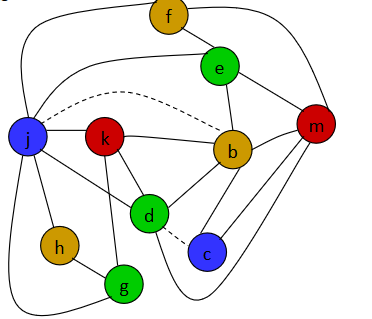
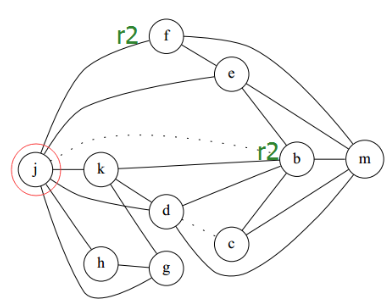

# step13 实验指导

本节实验要求实现论文 [TOPLAS'1996: *Iterated Register Coalescing*](https://dl.acm.org/doi/pdf/10.1145/229542.229546) 提出的寄存器分配算法。推荐大家完整读一遍论文，并通过[论文作者的讲解课件](https://people.cs.rutgers.edu/~zz124/cs516_spring2015/lectures/IteratedRegisterCoalescing.pdf)辅助理解。论文文末的附录有完整的伪代码，你可以在它的基础上完成本次实验。

下面简要介绍一些你可能需要的预备知识。

## 回顾：启发式寄存器分配算法

在[step 6 的数据流分析一节](../step6/dataflow.md)中，提到了活跃变量的概念。即对于一个临时变量来说，如果它在某个执行点处具有的值会在这个执行点以后被用到，那么它在这个执行点处是活跃的。

而在[step5 中提到了一个简单的启发式寄存器分配算法](../step5/example.html#简单的启发式寄存器分配算法)。在给一个变量分配寄存器时，它的大致思路如下：

- 首先检查是否存在空闲的寄存器，有则直接分配给当前变量。
- 否则，检查是否存在寄存器，使得它关联的临时变量在当前位置已经不是活跃变量了，如是则把它关联到当前变量。
- 否则，说明所有寄存器所关联的变量都是活跃的。此时随机选择某个寄存器，把它关联的临时变量存到栈帧上（这叫做溢出（`spill`）到内存），然后把它关联到当前变量。

## 基于图染色的寄存器分配算法

我们可以换一种角度去思考寄存器分配问题：两个变量在什么情况下不能被分配到同一个寄存器？当且仅当两个变量同时活跃时，它们不能被分到同一个寄存器。可以把这样的一对变量定义为相干的(interference)，或者说相互冲突的。

重用一下 step 6 中活跃变量的例子：

| TAC 代码            | 活跃变量集合          | 相干寄存器                           |
| ----------------- | --------------- | ------------------------ |
| `_T0 = 4`         | {_T0}           |                                 |
| `_T1 = 3`         | {_T0, _T1}      | (_T0,_T1)                       |
| `_T2 = _T0 * _T1` | {_T0}           |                                 |
| `_T3 = _T0 * _T0` | {_T0, _T3}      | (_T0,_T3)                       |
| `_T2 = _T3 * _T3` | {_T0, _T2, _T3} | (_T0,_T2),(_T0, _T3),(_T2, _T3) |
| `_T2 = _T0 * _T2` | {_T2, _T3}      | (_T2,_T3)                       |
| `_T1 = _T2 * _T3` | {_T1}           |                                 |
| `return _T1`      | {}           |                                 |

这时我们再提出一个问题：最少可以用多少个寄存器完成上面代码的寄存器分配？

容易发现，至少需要3个寄存器。因为 `_T0,_T2,_T3` 相互冲突，需要各一个寄存器，而 `_T1` 可以跟 `_T2` 或者 `_T3` 共用寄存器。

这个思路相比代码框架中的启发式寄存器分配算法有以下好处：

- 尽量减少使用的寄存器个数，在函数调用或返回时需要保存或恢复尽量少的 `callee save/caller save` 寄存器，减少变量溢出到内存的次数。这一部分对运行效率的影响很大，因为访存通常比访问寄存器慢很多。
- 方便全局优化寄存器分配，减少基本块之间的 `move` 指令。

事实上，我们可以用图染色问题去描述“相互冲突的变量”：

- 图染色问题：有 `n` 个结点，`m` 条边，你需要给每个结点指定一个颜色，使得任意两个有边直接相连的结点的颜色不同。

- 寄存器分配问题：有 `n` 个变量，`m` 组冲突的变量。你需要给每个变量指定一个寄存器，使得任意两个冲突的变量的寄存器不同。



上面这两个问题描述是一一对应的。如图所示（暂时先忽略图中的虚线边），如果把每个字母看成一个变量，每种颜色看成一个寄存器，那么图中的染色方案就对应了一个寄存器分配方案。

##### 如何找到所有冲突的变量

这里只提一个最简单的思路：看上面我们分析时列出的表格，先列举出每一步的活跃变量集合，然后两两连边。

##### 如何解决寄存器分配对应的图染色问题

假定我们有 `k` 种颜色可用于染色（对应 `k` 个寄存器可用于存放变量），那么可以依照下面的顺序执行

1. 寻找图中是否有连接了少于 `k` 条边的结点，如果有，把它记录下来然后从图中删除。重复这个步骤直到不存在少于 `k` 条边的结点。
2. 如果图中已经没有结点，则进入步骤3；否则，此时图中所有点都连接了至少 `k` 条边。这时，选择一个点（可以随机选，但可以通过其他信息来优化你的选择），把它记录下来然后从图中删除。然后重复步骤1。
3. 按删除的逆序恢复所有结点。
   1. 当恢复一个从步骤1删除的结点时，因为当前它连接了少于 `k` 条边，所以我们总能为它指定一个颜色，使之不和相邻的最多 `k-1` 个点的颜色冲突。
   2. 当恢复一个从步骤2删除的结点时，检查它连接的所有边。如果我们足够幸运，与它相邻的所有点没有用完所有 `k` 种颜色，那么我们可以为这个点指定一个不冲突的颜色。否则，为它选择一个颜色，这意味着它和另一个变量被分配到同一个寄存器里。别担心，这不会导致算法失败，只是会使得这个变量在使用时需要从栈帧保存与恢复，对应启发式寄存器分配算法中溢出（`spill`）到内存的情况。
4. 将每种颜色对应到寄存器上，生成后端代码。

## 基于复制指令的寄存器合并

在图染色的基础上有一种合并寄存器的进阶方法：合并通过复制指令(`copy instructions`)（其实就是赋值）传值的寄存器。

例如下面的代码

```c
int f() {
    int a = 1;
    int b = a;
    int c = a + 2;
    int d = b + 3;
    return a + b + c + d;
}
```

用上面提过的活跃变量分析可以算出，在 `c = a + 2` 执行时 `a` 和 `b` 都是活跃变量。但观察代码可以发现 `a` `b` 事实上存的是同样的值，只需要用同一个寄存器存就行。这篇论文使用了这个优化，并改进了前人的类似优化方案。

这样我们可以在图染色问题中把仅因复制（其实就是赋值）指令相互冲突的一对点之间的连边标记成虚线，表示如果它们最终染同一种颜色，就可以删去这条边然后合并这两个点。这有助于把上述图染色算法中从步骤2删去的点挪到步骤1删去，避免溢出到内存的情况。

##### 可以直接合并这两个点吗？

可以，但可能会导致产生出连接许多边的结点，反而使得后续染色困难，不得不溢出到内存。这实际上是更早的 `Chaitin` 的解决方案。

##### 可以在保证合并后边数 `<k` 的情况下合并这两个点吗？

可以，但这样合并的点数比较少，优化效果差。这实际上是更早的 `Briggs` 的解决方案。

##### 可以不合并但强制这两个点同色吗？

不可以。如下图所示，`j，b`因复制指令冲突，`j,f`因其他指令冲突，但`b,f`之间没有冲突，所以涂色算法中有可能会把 `b,f`涂成相同颜色。这样就会导致 `j` 的颜色和 `b` 相同，从而意外地和 `f` 相同，导致溢出到内存。



##### 这篇实验要求实现的论文的解决方案

把图中当前所有结点中，连接了至少 `k` 条边的结点标记为 `significant-degree` 的。看上述图染色算法流程，可以发现如果一个点不是 `significant-degree` 的，它会在步骤1被删除。

对于仅因复制指令相互冲突的一对点 `(a,b)`，可以如此检查它们是否可以合并：

- 统计与 `a` 或者 `b`有边相连的所有结点中有多少个 `significant-degree` 点。如果有 `<k` 个，说明最多有 `k-1` 个结点不会在在步骤1被删除，因此如果 `a` `b` 合并，这个合并后的点也会在步骤1被删除。在步骤1被删除就意味着合并后的 `a` 和 `b` 一定能找到一种不和周围任何一个点冲突的颜色，从而不会出现上图的情况。
- 如果不能合并，那么把 `a` 和 `b` 中间的虚线边改为实线，表示不再考虑二者合并的情况。

上面的说明只是简要介绍了算法的原理，请阅读论文 [TOPLAS'1996: *Iterated Register Coalescing*](https://dl.acm.org/doi/pdf/10.1145/229542.229546) 获取更详细的说明。**别忘了论文末尾的附录有完整的伪代码实现。**
