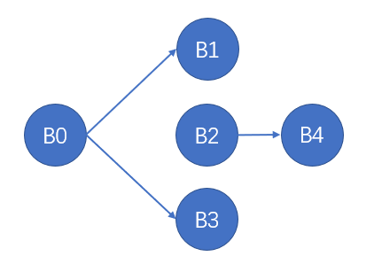

# 数据流分析

编译优化的基础是**数据流分析**。

基本块（basic block）和控制流图（control-flow graph）是用于进行上述分析的数据结构。

以下讲述数据流分析的内容中，所有的 CondBranch 指令为条件跳转指令，Branch 指令为跳转指令。

## 基本块

基本块是指一段这样的代码序列：

1. 除出口语句外基本块中不含任何的 Branch、Beqz（条件为假时跳转）、Bnez（条件为真时跳转）或者 Return 等跳转语句（但可以包含 Call 语句）。

2. 除入口语句外基本块中不含任何的 Label 标记，即不能跳转到基本块中间。

3. 在满足前两条的前提下含有最多的连续语句，即基本块的头尾再纳入一条语句将会违反上面两条规则。

下面的例子中，代码中不同的基本块被标以不同的颜色：


也就是说，基本块内的代码执行过程总是从基本块入口开始，到基本块出口结束的，中间不会跳到别的地方或者从别的地方跳进来。

## 控制流图

控制流图是一个有向图：它以基本块作为结点，如果一个基本块 A 执行完之后，有可能跳转到另一个基本块 B，则图中包含从 A 对应结点到 B 对应结点的有向边。对于以 Branch 语句或者任何非跳转语句结尾的基本块，其后继只有一个结点；对于以 CondBranch 语句结尾的基本块，其后继含有两个结点，分别对应跳转条件为真和假的情况。不难想像，控制流图的有向边组成的每一个环路都对应着程序中的一个循环结构。由于该图给出程序控制流的各种可能执行路径，因此也称为控制流图。

为进行编译优化，建立控制流图是必不可少的一步。已知一个操作序列，如何根据这个操作序列建立对应的控制流图呢？通常分为两步进行：

1. 划分基本块。

2. 建立基本块之间的连接关系。

基本块的划分算法比较简单：从头到尾扫描操作序列，当遇到以下情况时结束当前基本块，并开始一个新的基本块建立过程：

1. 当遇到一个 Label 标记而且存在跳转语句跳转到这个行号时。

2. 当遇到 Branch、CondBranch 或者 Return 等跳转语句时。

整个操作序列扫描完毕后，我们就成功建立了所有基本块。

在划分好基本块之后，需要从头到尾依次扫描所有的基本块建立控制流图：

1. 如果当前基本块以 Branch 结尾，则在当前基本块与所跳转到的目标基本块之间加入一条有向边。

2. 如果当前基本块以 CondBranch 结尾，则在当前基本块和跳转条件成立与不成立的目标基本块之间分别加入一条有向边（共 2 条边）。

3. 如果当前基本块以 Return 结尾，则不需要加入新的边。

在所有的基本块都扫描完毕后，即建立了控制流图。基于控制流图，可以进行控制流分析。

上面例子对应的控制流图如下：



## 活跃变量和活跃变量方程

从编译器中端出来的中间代码中，我们对 TAC 中使用的临时变量的个数并没有做任何限制。但是在实际机器中，物理寄存器的数量是有限的。

因此我们需要想办法把这些无限多的临时变量“塞”到有限个物理寄存器里面：如果两个临时变量不会在同一条指令中被用到，那么我们可以让这两个临时变量使用同一个物理寄存器（把一部分当前指令用不到的临时变量保存到栈上）。

根据这样的原则，大多数的临时变量都可以用有限的几个物理寄存器对应起来，而“塞不下”的那些临时变量，则可以暂时保存到内存里面（因为访问内存的时间比访问寄存器的时间多得多，因此临时变量应尽可能一直存放在物理寄存器中，尽量不要 spill 到栈上）。

由于一个物理寄存器在确定的时刻只能容纳一个临时变量，因此为了把若干个变量塞到同一个物理寄存器里面，我们需要知道各个临时变量分别在哪条指令以后不会再被用到（以便腾出当前临时变量占用的物理寄存器给别的临时变量）。此时我们需要用到活性分析（liveness analysis），或者称为“活跃变量分析”。

一个临时变量在某个执行点是活的（也叫“活跃”、live），是指该临时变量在该执行点处具有的值会在这个执行点以后被用到，换句话说，就是在该执行点到给这个临时变量重新赋值的执行点之间存在着使用到这个临时变量的语句。活性分析是指分析每一个临时变量在程序的每一个执行点处的活跃情况，通常是通过计算出每个执行点处的活跃变量集合来完成。

下面代码中每行语句右边都给出了执行完该语句后的活跃变量集合：

| TAC 代码          | 活跃变量集合    |
| ----------------- | --------------- |
| `_T0 = 4`         | {_T0}           |
| `_T1 = 3`         | {_T0, _T1}      |
| `_T2 = _T0 * _T1` | {_T0}           |
| `_T3 = _T0 * _T0` | {_T0, _T3}      |
| `_T2 = _T3 * _T3` | {_T0, _T2, _T3} |
| `_T2 = _T0 * _T2` | {_T2, _T3}      |
| `_T1 = _T2 * _T3` | {_T1}           |
| `return _T1`      | 空集            |

一般来说，活性分析是通过求解活跃变量方程来完成的。为了介绍活跃变量方程的概念， 我们需要先引入下面四种针对基本块的集合：

1.  Def 集合：一个基本块的 Def 集合是在这个基本块内被定值的所有变量。所谓的定值 （definition），可以理解为给变量赋值，例如加法语句给目标变量定值等（注意：Store 语句不给任何变量定值，Load 语句则会给对应变量定值）。

2. LiveUse 集合：一个基本块的 LiveUse 集合是在这个基本块中所有在定值前就被引用过的变量，包括了在这个基本块中被引用到但是没有被定值的那些变量。

3. LiveIn 集合：在进入基本块入口之前必须是活跃的那些变量。 

4. LiveOut 集合：在离开基本块出口的时候是活跃的那些变量。

其中 Def 和 LiveUse 是基本块本身的属性，对每个基本块从后往前遍历基本块内的指令便可以求出。

有了基本块的这四个集合的概念，我们给出控制流图中每个基本块满足的活跃变量方程:


该方程说的是一个基本块的 LiveOut 集合是其所有后继基本块的 LiveIn 集合的并集，而且 LiveIn 集合是 LiveUse 集合的变量加上 LiveOut 集合中去掉 Def 集合以后的部分。

这个方程的直观意义是：

1. 一个基本块的任何一个后继基本块入口处活跃的变量在这个基本块的出口必须也是活跃的。

2. 在一个基本块入口处需要活跃的变量是在该基本块中没有定值就被使用的变量，以及在基本块出口处活跃但是基本块中没有定值过的变量（因为它们的初值必定是在进入基本 块之前就要具有的了）。

根据这个方程，我们可以通过迭代更新的办法求出每个基本块的 LiveIn、LiveOut 集合，以下是求解的伪代码：

```
for i <- 1 to N do compute Def[B_i] and LiveUse[B_i]; 
for i <- 1 to N do LiveIn[B_i] <- phi ; 
changed <- true; 
while (changed) do { 
    changed <- false; 
    for i <- N downto 1 do {   
        LiveOut[B_i] <- Union (LiveIn[s]) where s belongs to succ(B_i) ;
        NewLiveIn <- Union (LiveUse[B_i], (LiveOut[B_i] – Def[B_i])); 
        if (LiveIn[B_i] != NewLiveIn) then {     
            changed <- true;     
            LiveIn[B_i] <- NewLiveIn;   
        }    
    } 
}
```

获得了每个基本块的 LiveIn 和 LiveOut 集合以后，我们需要进一步地计算基本块内每个 TAC 语句的 LiveIn 和 LiveOut 集合。如果我们把基本块内所有 TAC 语句分别看成是一个独立的基本块，则不难想像，前面提到的活跃变量方程仍然有效，不同之处在于，一个基本块对应的 “控制流图” 有以下三种特点：

1. 每个节点的出度都是 1，也就是说 LiveOut(B) = LiveIn(Succ(B))。

2. 由于每个结点只含有一个语句，因此其 Def 集要么是空集，要么只含有一个元素。

3. 由于每个结点对应的语句里所引用的所有变量在使用的时候都未在该基本块中经过定值，其 LiveUse 集合就是源操作数对应的所有变量。 

基于上面三个特点，已经求出基本块的 LiveOut 集合的前提下我们只需要在每个基本块内从后往前遍历基本块内的指令就可以对每条基本块内指令求出 LiveIn、LiveOut。
