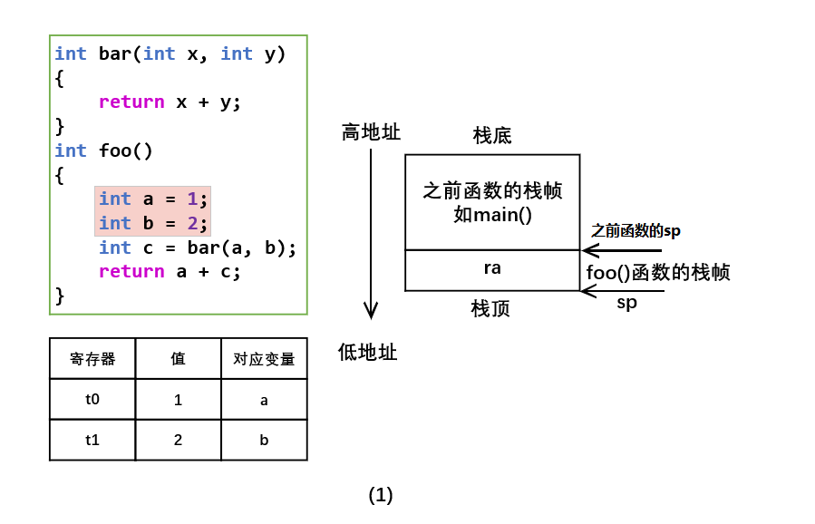
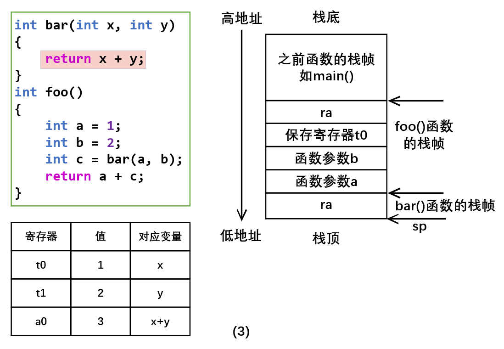
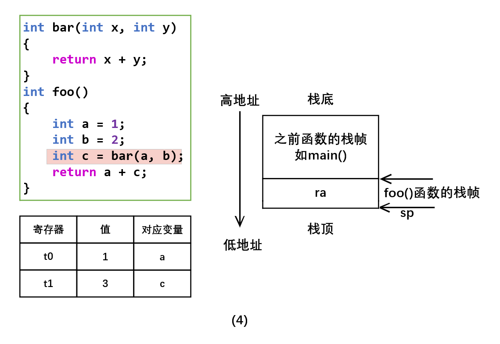
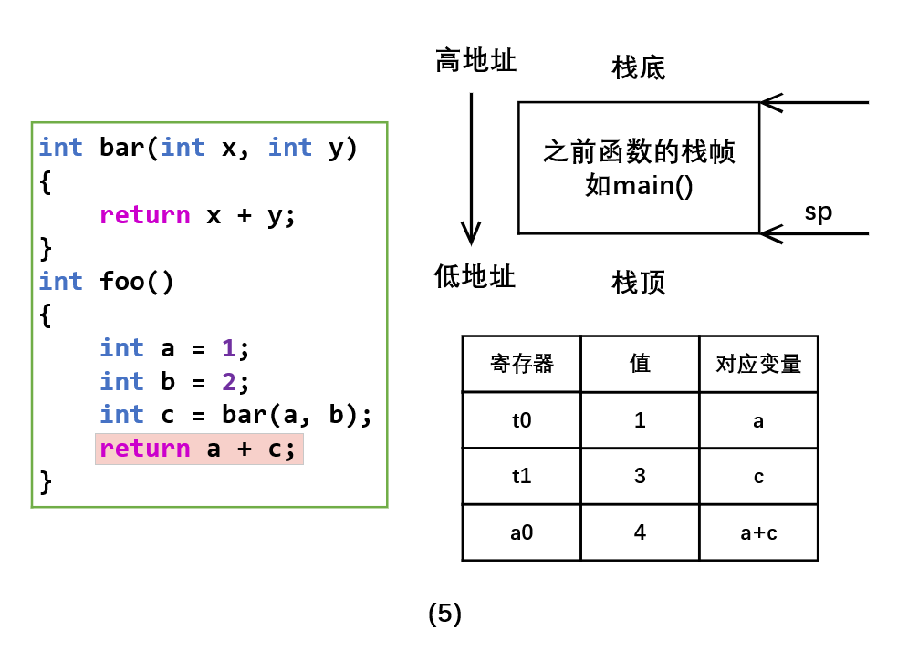

# step9 实验指导

本实验指导使用的例子为：

```C
int func(int x, int y) { 
    return x + y; 
}

int main() { 
    return func(1, 2); 
}
```

## 词法语法分析

针对函数特性，我们需要设计 AST 节点来表示它，给出的参考定义如下：

| 节点 | 成员 | 含义 |
| --- | --- | --- |
| `Function` | 返回类型 `return_type`，函数名 `ident`，参数列表 `params`，函数体 `body` | 函数 |
| `Parameter` | 参数类型 `var_type`，变量名 `ident` | 函数参数 |
| `Call` | 调用函数名 `ident`，参数列表 `argument_list` | 函数调用 |

## 语义分析

本步骤中引入了函数，和局部变量类似，不允许调用未声明的函数，也不允许重复定义同名函数（允许重复声明，但要求声明类型一致）。因此，需要在全局作用域的符号表里维护函数符号。函数符号存放在栈底的全局作用域中，在遍历 AST 构建符号表的过程中，栈底符号表一直存在，不会被弹出。

此外，由于函数体内部除了局部变量以外，还有**函数参数**（argument）。因此，我们进入一个函数，开启函数体局部作用域时，需要将所有的参数加进该作用域的符号表中。举例来说，如果我们将示例改成：

```C
int func(int x, int y) { int x = 1; return x + y; }
```

那么语义检查时应当报错。

函数符号的实现在 `frontend/symbol/funcsymbol.py` 中。

## 中间代码生成

为了实现函数，我们需要设计至少一条中间代码指令来表示函数调用，给出的参考定义如下：

> 请注意，TAC 指令的名称只要在你的实现中是一致的即可，并不一定要和文档一致。

| 指令 | 参数 | 含义 |
| --- | --- | --- |
| `CALL` | `LABEL(T0, T1, ...)` | 调用函数 LABEL，传入的实参为T0、T1等 |

下面是一段含有函数调用的代码片段：

```assembly
T0 = CALL foo(T1, T2)
```

`T1`和`T2`作为被调用函数`foo`的实参，而调用后的返回值保存在`T0`中。

实际上这与高级语言的函数语义非常相似。你可能会觉得一个与源语言语义几乎没差别的中间代码函数调用指令有点多余，所以我们也提供了另一种方案。

> 在早先的文档中，函数调用涉及`CALL`和`PARAM`两种指令。`CALL`指令只对应实际汇编代码的函数调用，而`PARAM T0`指令用于传递一个参数。

> 假设我们有若干个参数，可以依次使用 PARAM 命令将它们加入参数列表。在调用函数时，这些参数的值会自动依次按顺序装载到临时变量 _T0, _T1 ... 中。比如我们有这样一段 TAC 程序：

```assembly
PARAM A
PARAM B
PARAM C
XX = CALL XXX
```

> 那么，在进入 XXX 函数时，相当于执行了：

```assembly
_T0 = A
_T1 = B
_T2 = C
```

> 因此，示例可以对应如下的 TAC 程序：

```assembly
func:
	_T2 = ADD _T0, _T1
    return _T2        # 参数 x 和 y 分别对应 _T0, _T1
main:
    _T0 = 1
    PARAM _T0         # 将 _T0 的值作为参数 x
    _T1 = 2
    PARAM _T1         # 将 _T1 的值作为参数 y
    _T3 = CALL func   # 调用函数
    return _T3
```

同学们可以选择使用这两种方案中的任何一种，也可以自行设计函数调用的中间表示。

### 思考

在本次实验中我们设置了一道关于函数调用中间表示设计的思考题。下面的问题或许能帮助你思考（你无需回答这里的问题，这里也没有标准答案）：

1. 中间表示应该更接近源语言（高级语言）还是目标语言（例如汇编语言）？
2. 到目前为止实验文档给出的参考中间表示更接近源语言还是目标语言？

如果你感兴趣，可以了解一下LLVM IR。

## 目标代码生成

```assembly
    .text
    .global main

func:
    # start of prologue
    addi sp, sp, -56
    # end of prologue

    # start of body
    sw a0, 0(sp)
    sw a1, 4(sp)
    lw t0, 0(sp)
    lw t1, 4(sp)
    add t2, t0, t1
    mv t0, t2
    mv a0, t0
    j func_exit
    # end of body

func_exit:
    # start of epilogue
    addi sp, sp, 56
    # end of epilogue

    ret

main:
    # start of prologue
    addi sp, sp, -56
    sw ra, 52(sp)
    # end of prologue

    # start of body
    li t0, 1
    li t1, 2
    mv a0, t0
    mv a1, t1
    call func
    mv t0, a0
    mv a0, t0
    j main_exit
    # end of body

main_exit:
    # start of epilogue
    lw ra, 52(sp)
    addi sp, sp, 56
    # end of epilogue

    ret
```

首先你需要参考之前步骤中实现的方法，**翻译本步骤中新增的中间代码指令**。

### 后端

这部分你需要着重关注后端代码生成部分，相关代码包括`utils/riscv.py`,`backend/riscv/riscvasmemitter.py`,`backend/reg/bruteregalloc.py`。

下面，我们对后端的关键代码进行简要介绍。

后端翻译是Asm类开始的：

```python
class Asm:
    def __init__(self, emitter: RiscvAsmEmitter, regAlloc: BruteRegAlloc) -> None:
        self.emitter = emitter
        self.regAlloc = regAlloc

    def transform(self, prog: TACProg):
        analyzer = LivenessAnalyzer()

        for func in prog.funcs:
            pair = self.emitter.selectInstr(func)
            builder = CFGBuilder()
            cfg: CFG = builder.buildFrom(pair[0])
            analyzer.accept(cfg)
            self.regAlloc.accept(cfg, pair[1])

        return self.emitter.emitEnd()
```

这里代码的转换有三个阶段：

中端TACInstr -> 后端TACInstr -> NativeInstr

`self.emitter.selectInstr(func)`这里对每个函数调用了 selectInstr进行函数内的**指令选择**，这部分将 中端TACInstr 翻译为了 后端TACInstr 指令，`RiscvInstrSelector`进行指令选择后将生成的 后端TACInstr 放在了 `RiscvInstrSelector`类的`seq`成员中，其实就是一个列表，此处还**没有进行寄存器分配**，仅将 中端TACInstr 换为了 后端TACInstr 。

`self.regAlloc.accept(cfg, pair[1])`函数进行了寄存器分配，`BruteRegAlloc`类将 后端TACInstr 转化为了 NativeInstr，`RiscvSubroutineEmitter`类将这些 NativeInstr 放在了 buffer 中，最后全部在emitEnd()函数中输出.

- 框架中的 后端TACInstr 和 NativeInstr 指令有什么不同？
  
  后端TACInstr 是**没有经过寄存器分配的指令**，其参数依然是临时变量（或称为虚拟寄存器），但是你可能发现部分指令中含有物理寄存器，因为有的指令需要使用指定的寄存器，比如`x0`寄存器，或者修改栈指针`sp`寄存器，物理寄存器和虚拟寄存器混合出现在一条指令中的情况是必然存在的。
  
  NativeInstr 指令是 **经过寄存器分配后的 中端TACInstr**，其所有参数都是Riscv的实际寄存器。

  我们要先进行指令选择后才能确定每条指令需要的寄存器情况，因此这里需要两个步骤。

- 为什么指令要先放在buffer中，最后再一次性输出？
  
  因为寄存器分配过程中我们才能知道有哪些变量需要spill到栈上，分配完所有指令需要的寄存器计算出需要的栈空间大小，因此类似函数开头开辟栈空间的指令`add sp, sp, -56`这样的指令会放在prologue部分。

#### 寄存器分配部分
这部分代码主要集中在`backend/reg/bruteregalloc.py`。

首先我们介绍一下`BruteRegAlloc`类中的对象和函数都干了什么：
`bindings`用来记录每个临时变量和物理寄存器的对应关系，比如临时变量`T4`如果存放在寄存器`A0`中，那么`bindings`中就会记录
`T0: A0`。你可以通过使用`bind()`, `unbind()`函数来控制绑定关系。


`accept()`，也就是寄存器分配的起点：
```python
def accept(self, graph: CFG, info: SubroutineInfo) -> None:
    subEmitter = self.emitter.emitSubroutine(info)
    for bb in graph.iterator():
        # you need to think more here
        # maybe we don't need to alloc regs for all the basic blocks
        if bb.label is not None:
            subEmitter.emitLabel(bb.label)
        self.localAlloc(bb, subEmitter)
    subEmitter.emitEnd()
```
这里对于控制流图（CFG）中的每一个基本块分配了寄存器。

`localAlloc()`用来给每个基本块指令分配寄存器。我们的实验框架采用了非常简单暴力的寄存器分配：每个基本块前后我们认为所有变量都在栈上，所以你可以在代码中看到`localAlloc()`函数开头我们使用了`self.bindings.clear()`来清除寄存器和栈上变量之间的绑定关系，在分配完每个基本块的寄存器后，我们通过对于所有活跃的寄存器调用`emitStoreToStack`保存到了栈上。

因此，在实现Step 9时候，我们虽然使用了寄存器传参，但是我们应该要认为在进入每个基本块的时候，所有变量还是在栈上的。因此我们在生成代码的时候，就应该提前先把变量放到栈上，我们可以通过修改`RiscvSubroutineEmitter`中的`offsets`的来把临时变量和栈上位置对应起来。然后怎么把寄存器放到栈上呢？我们可以看`RiscvSubroutineEmitter.emitEnd`函数，我们会在翻译完所有代码后先把代码保存到buffer里面，先打印一些函数头的信息，然后输出这个buffer中的东西，所以我们就可以在函数头这里把在寄存器中的东西放到栈上。

`allocForLoc()`为每条指令具体分配寄存器。每条指令都有可能要读和写部分临时变量，但是这些临时变量可能不在物理寄存器中，在栈上，因此这个函数为每个需要读、和写的寄存器进行检查是否能在`bindings`中找到绑定关系，如果不在则通过`allocRegFor()`函数来将这些寄存器拿到栈上。

`allocRegFor()`为每个临时变量分配寄存器。对于`allocForLoc()`中发现的如果有的寄存器在当前指令中需要用到，并且不在物理寄存器中，那么则需要将其从栈上拿出来。并且这个函数判断了现有物理寄存器是否已经被占用，如果所有物理寄存器都被占用，那么就需要将一些暂时不用的寄存器放到栈上。

### 函数调用

程序代码里的一个函数调用，包含了下面一系列的操作：

1. （汇编）保存 caller-saved 寄存器。
2. 准备参数，完成传参。
3. 执行汇编中的函数调用指令，开始执行子函数直至其返回。
4. 拿到函数调用的返回值，作为函数调用表达式的值。
5. （汇编）恢复 caller-saved 寄存器。

上述步骤 1-5 称为调用序列（calling sequence）。然而，调用序列中有一些问题需要解决：如何进行参数传递？如何获取函数返回值？调用者（caller）和被调用者（callee）需要保存哪些寄存器，如何保存？调用者和被调用者通常对以上问题约定解决方式，并同时遵守这些约定。这些调用者与被调用者共同遵守的约定称为**调用约定**（calling convention）。调用约定通常在汇编层级使用，汇编语言课上也有涉及。因为汇编语言是低级语言，缺乏对函数的语言特性支持，只有标号、地址、寄存器，所以需要调用约定，规定如何用汇编的语言机制实现函数调用。

### 调用约定

位了简化同学们的实现，实验测例中没有与 gcc 编译的文件相互调用的要求，因此，大家不一定需要实现标准调用约定。你甚至可以完全使用栈来传递参数，而不使用寄存器。但是，如果你想要实现标准调用约定，可以参考下面的内容。

<!--

#### 简化版的非标准调用约定

1. caller-saved 和 callee-saved 寄存器

   callee 只需要保存 ra 寄存器。ra 寄存器保存函数返回地址。程序实验框架中提供了数据流分析模块，caller 只需保存活跃变量对应的寄存器内容（数据流分析和活跃变量见 step6）。

2. 函数参数及返回值的传递

   不使用寄存器进行传参，所有参数从右往左压栈，第 1 个参数在栈顶。

   返回值（32 位 int）放在 a0 寄存器中。

### 函数调用过程中的栈帧变化（使用非标准调用约定）

为了帮助大家更好的理解，我们使用上述的**简化版的非标准调用约定**，画出了一段具有代表性的程序，其整个运行过程中栈帧的组成部分以及变化。代表性程序如下：

```C
int bar (int x, int y) {
    return x + y;
}
int foo () {
    int a = 1; 
    int b = 2;
    int c = foo(a, b);
    // return a+c 的目的是为了讲解保存活跃变量的情况
    return a + c;         
}
```



（1） foo 函数被调用，栈帧建立，变量 a 与 b 被分配对应寄存器。


（2）调用 bar 函数，由于变量 a 在函数调用结束之后还需要被使用（a+c），是活跃变量，需要保存到栈中。另外，按照调用约定对函数参数进行压栈传参。



（3）bar 函数内部进行运算，主要关注寄存器变化，栈帧方面仅仅是建立了 bar 函数的栈帧。



（4）bar 函数调用返回，其栈帧被销毁。



（5）foo 函数调用返回，其栈帧被销毁。


接下来详细介绍比较标准的函数调用的步骤和约定，以及函数调用及返回过程中栈帧的变化。

-->

#### RISC-V 的标准调用约定

1. caller-saved 和 callee-saved 寄存器

   

   上表给出 RISC-V 中 32 个整数寄存器的分类。所谓 caller-saved 寄存器（又名易失性寄存器），是指不需要在各个调用之间保存的寄存器，如果调用者认为在被调用函数执行结束后仍然需要用到这些寄存器中的值，则需要自行保存。所谓 callee-saved 寄存器（又名非易失性寄存器），指这些寄存器需要在各个调用之间保存，调用者可以期望在被调用函数执行结束后，这些寄存器仍保持原来的值。这要求被调用者，如果使用这些寄存器，需要先进行保存，并在调用返回之前恢复这些 callee-saved 寄存器的值。

   具体的保存方法并不限制，但一般都使用栈来保存。

2. 函数参数以及返回值的传递

   函数参数（32 位 int）从左到右存放在 a0 - a7 寄存器中，如果还有其他参数，则以从右向左的顺序压栈，第 9 个参数在栈顶位置。同学们可以使用编写一个带有多个参数的函数并进行调用，然后用 gcc 编译程序进行验证。

   返回值（32 位 int）放在 a0 寄存器中。


## 实战教学

我们推荐大家按照以下步骤实现，当然这不是唯一的实现方式。前中端的部分在前面的step中涉及很多，大家应该已经比较熟悉，这里依然关注后端要做的事。

### 后端**主要**需要修改的文件：
`backend/reg/bruteregalloc.py`和`backemd/riscv/riscvasmemitter.py`

### 要做什么
1. 调用者需要按照调用约定放置参数，这会涉及寄存器保存、参数移动到正确的位置等操作，因此需要修改寄存器分配过程。
2. 被调用者需要从正确的位置拿到参数，以及处理上下文信息（包括返回地址、callee-save寄存器等），这些信息大多都是在函数开始时和结束时保存和恢复，因此需要修改函数汇编生成部分代码。

### 对于调用者的处理：

这里我们需要关注`BruteRegAlloc`类。

1. `localAlloc`函数处，我们可以使用`isinstance`来判断一条指令是不是一条`Call`指令（你也可以自己保存别的信息在`TACInstr`中用来辅助判断），如果是则保存所有被占用的caller-save寄存器，并且将他们与临时变量解绑。`subEmitter.emitStoreToStack`可以帮助我们用来把一个变量放在栈上，`unbind`函数可以用来解绑寄存器的绑定关系（通过`Riscv`类可以找到所有物理寄存器）。

2. 特殊处理`allocForLoc`函数，`allocForLoc`会为每一条Tac指令分配寄存器，但是我们对于函数应该特殊处理，因为对于其他指令来说，分配的寄存器可以是随机的，但是函数调用要使用固定的寄存器。所有传参用到的寄存器(a0~a7)都是caller-save寄存器，1中的操作保证了传参所需要的寄存器都是空的，因此直接将参数放到寄存器中即可。具体地，用物理寄存器`a0`~`a7`传递被调用函数的前8个参数，我们假设这8个参数对应的临时变量（Temp）为`v0`~`v7`。对于第i个参数，目标是将`vi`的值加载入`ai`。若`vi`已经与某个物理寄存器`xj`绑定，则可以生成指令`mv ai, xj`；如果vi的值不在物理寄存器中，调用`emitLoadFromStack`。（思考： 如果前面不解除volatile寄存器的绑定，这里可能会有什么问题？ 你有更高效的解决方案吗？）

- 为什么有的临时变量会在寄存器中？
因为我们在步骤1中只保存的caller-save寄存器，如果一个寄存器是callee-save寄存器，其中存放的临时变量就不会在上一个步骤被放到栈上。

3. **（可选）**处理参数超过8个的情况，为了降低大家的实现难度，我们不对参数超过8个的传参实现进行测试。在2中我们处理了使用寄存器传参的情况，但是如果参数超过8个寄存器会放不下，现在需要使用栈进行传参。若参数`vi`在物理寄存器`xj`中，则直接将`xj`“压栈”，否则任选一个`a0`~`a7`之外的volatile寄存器`tk`，我们先通过`emitLoadFromStack`将`vi`加载到`tk`，然后“压栈”`tk`（建议直接使用`t0`寄存器）。需要注意这里的“压栈”不能直接用`emitStoreToStack`，我们需要手动生成一条store指令，而且它无需也不应该修改栈指针`sp`。在所有参数入栈后，统一修改`sp`。

4. 进行真正的函数调用，类似其他指令使用`emitNative`来生成一条调用指令。如果上一步中存在栈传参，别忘了把`sp`改回来。

5. 妥善处理函数返回值。根据调用约定，函数返回值会存放在`a0`寄存器中。如果你在指令选择中为函数调用单独增添了将`a0`移动到目标临时变量的指令，这里无需处理。你也可以选择直接将目标临时变量绑定到`a0`。

    如果你遇到了`IllegalArgumentException`的报错，那可能是将目标临时变量绑定到`a0`这一步导致的，因为`toNative`函数会覆盖`TACInstr`的`dsts`和`srcs`成员，导致在绑定寄存器时候没有将正确的临时变量和`a0`绑定到一起，实际上你可以在调用`toNative`之前就将返回值临时变量和`a0`绑定到一起。

6. **（可选）**你也许需要在`SubroutineEmitter`中记录当前函数是否调用过其它函数，以便减少不必要的`ra`保存和恢复。

### 对于被调用者的处理：

这里我们需要关注`RiscvSubroutineEmitter`类。被调用者需要从正确的位置拿到参数，以及处理上下文信息（包括返回地址、callee-save寄存器等）。

1. 保存和恢复`ra`寄存器
这里需要关注`emitEnd`函数。框架的现有部分已经帮助大家处理好了callee-saved寄存器的保存和恢复，你可以参照这部分实现`ra`寄存器的保存和恢复。但是注意留意`ra`和callee-saved寄存器的区别：`ra`会在什么情况下被修改？（当然，你可以选择总是保存和恢复`ra`）

2. `RiscvSubroutineEmitter`通过成员`nextLocalOffset`和`offsets`管理临时变量在栈上的位置，现在函数的输入参数对应的临时变量也应当纳入`offsets`的管理。比较大的问题来自于栈传递的参数，它们位于当前函数的栈帧之外，难以直接用于存放临时变量（栈帧固定前相对偏移会变化）。所以你需要在真正进入函数主体之前将栈参数的值复制到常规临时变量区域。类似地，对于用寄存器传递的参数，在函数主体前将它们保存在栈上即可。（对于寄存器传参的函数参数，也可以在寄存器分配过程中将对应的物理寄存器和参数临时变量直接绑定），具体地：

    a. 将参数取出放到栈上。我们的实验框架采用了非常简单暴力的寄存器分配，每个基本块前后我们认为所有变量都在栈上。因此我们可以在输出所有指令之前将在寄存器中的参数放到栈上。这样在后续指令看来这些参数和局部变量就没有什么区别了。

    b. 修改临时变量与栈上位置的对应关系。`init`函数中我们可以看到`offsets`映射，用来记录临时变量在栈上的位置，同时`nextLocalOffset`变量记录了栈上需要的空间大小，根据参数个数可以确定存放参数需要的栈空间，然后修改`offsets`映射可以将参数和临时变量对应起来。这里需要保证和a中参数放到栈上的位置对应。


### 提示
<!--
1. 你可能会注意到，`func`函数先将参数（`a0`, `a1`）保存到了栈上，又取出来使用，这是为了简化实现而做的，尽管我们使用寄存器传参，你可以直接将寄存器中的值保存到栈上（这样也满足了标准调用约定的），然后在后端指定某个临时变量（Temp）在栈上的位置，参考`backend/riscv/riscvasmemitter.py` 中 `class RiscvSubroutineEmitter(SubroutineEmitter):` 的实现，其中`offsets`变量用于保存临时变量在栈上的位置。
2. riscv中函数调用时会将返回地址保存到`ra`寄存器中。`ret`指令则会返回`ra`寄存器保存的地址处。
3. 你可能还会好奇，这里的`ra`寄存器为什么没有保存到栈上，参考 `emitEnd` 函数，我们可以只保存和恢复一个函数中使用的寄存器。
-->
1. 这部分实验有一定难度，建议早点开始。
2. 如果你发现后端代码有不便之处，可以按照自己的思路任意修改。

# 思考题
1. 你更倾向采纳哪一种中间表示中的函数调用指令的设计（一整条函数调用 vs 传参和调用分离）？写一些你认为两种设计方案各自的优劣之处。
2. 为何 RISC-V 标准调用约定中要引入 callee-saved 和 caller-saved 两类寄存器，而不是要求所有寄存器完全由 caller/callee 中的一方保存？为何保存返回地址的 ra 寄存器是 caller-saved 寄存器？
